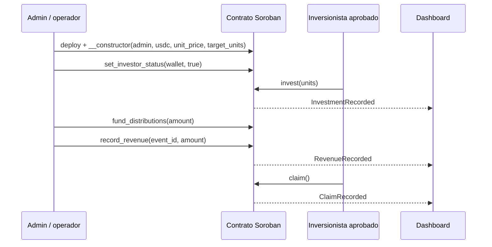

# Minka Capital

> Mercado primario simulado para notas de participacion en ingresos de startups peruanas, construido sobre Stellar/Soroban.

**Minka Capital es un prototipo exclusivamente para Stellar Testnet.** Usa empresas, activos y montos ficticios; no constituye una oferta de valores, recomendacion de inversion, servicio de custodia ni producto para dinero real.

## Problema

Las startups peruanas suelen depender de financiamiento lento, poco transparente y con escasa trazabilidad para aportantes. A la vez, los mecanismos de participacion en ingresos requieren registrar aportes, eventos de facturacion y distribuciones de manera auditable.

## Propuesta

Minka Capital modela una emision primaria ficticia: **LUMI-RSN**, una nota de participacion en ingresos de la startup demo *LumiSolar Peru*. Las wallets aprobadas adquieren unidades; un administrador registra eventos de ingresos idempotentes; y cada wallet puede consultar y reclamar su monto proporcional.

El diseno apunta al track **Realtime Systems & High-Velocity Finance** mediante eventos on-chain, contabilidad proporcional por evento e infraestructura preparada para actualizar el dashboard desde Stellar RPC.

## Flujo demo



Diagrama completo: [arquitectura y flujo](docs/architecture/minka-capital-system-flow.md).

## Integracion con Stellar

El contrato [`minka-market`](_scaffold_base/contracts/minka-market/src/lib.rs) se implementa en Rust con Soroban SDK y contiene:

- Constructor atomico (`__constructor`): la oferta se configura en la misma transaccion del despliegue, sin ventana para que un tercero la inicialice.
- Allowlist de wallets mediante `set_investor_status` y pausa de nuevas inversiones con `set_paused`.
- Limite de unidades de la oferta y control de sobreasignacion.
- Tesoreria segregada (`get_treasury`): capital levantado (`raised`), distribuciones fondeadas sin asignar (`available`) y distribuciones asignadas a inversionistas (`allocated`). Un mismo deposito no puede respaldar dos eventos de ingreso y los claims nunca usan capital de la oferta.
- `withdraw_raise` libera el capital levantado a la wallet de la startup sin tocar fondos de distribucion.
- Registro idempotente de ingresos por `event_id`.
- Calculo proporcional con precision escalada y checkpoints por posicion (un inversionista tardio no cobra ingresos previos). El redondeo de la division pro-rata deja un residuo minimo en `allocated`.
- Extension de TTL del almacenamiento en cada operacion para que el estado no se archive durante la demo.
- Eventos Soroban: `OfferingCreated`, `OfferingPauseChanged`, `InvestorStatusChanged`, `InvestmentRecorded`, `RaiseWithdrawn`, `DistributionFunded`, `RevenueRecorded` y `ClaimRecorded`.
- Autorizacion de la wallet para invertir/reclamar y del administrador para operaciones privilegiadas.

La interfaz React/Vite inicial esta en [`_scaffold_base/app`](_scaffold_base/app) y muestra el dashboard de la oferta, posicion, tesoreria y feed de eventos.

### Estado actual del MVP

| Componente | Estado |
| --- | --- |
| Contrato de oferta, allowlist y reparto proporcional | Implementado y con pruebas unitarias |
| Eventos Soroban para indexacion | Implementado |
| Dashboard React | Conectado al contrato: lecturas on-chain, invest/claim firmados, consola admin y feed en vivo via `getEvents` |
| Transferencias reales de USDC Testnet mediante SAC | Implementado y probado localmente |
| Despliegue en Testnet | Desplegado (ver IDs abajo); demo de inversion/claim pendiente de USDC del faucet |

Por transparencia: el contrato ahora cobra el activo SAC configurado al invertir, mantiene un fondo separado para distribuciones y `claim()` transfiere el monto proporcional. La direccion real del SAC USDC, la wallet y el despliegue Testnet aun deben configurarse antes de la demo final.

## Evidencia verificable

Las pruebas cubren:

1. Configuracion del SAC, precio unitario y validacion del constructor.
2. Escrow del pago de la inversion en el contrato.
3. Distribucion pro-rata 60/40, transferencia SAC y reinicio del saldo tras `claim`.
4. Checkpoints: un inversionista tardio no recibe ingresos anteriores.
5. Tesoreria segregada: un deposito no respalda dos ingresos, los claims no usan capital y `withdraw_raise` no toca distribuciones.
6. Pausa de la oferta sin bloquear claims.
7. Rechazo de wallets no aprobadas, sobreasignacion, admin incorrecto, eventos duplicados, ingresos no fondeados y claims vacios.

Ejecutar (17 pruebas, todas en verde el 25 de septiembre de 2026):

```powershell
cd _scaffold_base
cargo test -p minka-market
```

En Windows con Control de aplicaciones inteligente activo, los build scripts de Cargo pueden quedar bloqueados. Alternativa con Docker:

```powershell
cd _scaffold_base
docker run --rm -v "${PWD}:/work" -v minka-target:/target -e CARGO_TARGET_DIR=/target -w /work rust:1.93 cargo test -p minka-market
docker run --rm -v "${PWD}:/work" -v minka-target:/target -e CARGO_TARGET_DIR=/target -w /work rust:1.93 cargo build -p minka-market --target wasm32v1-none --release
```

Los errores del contrato se exponen como codigos estables `Error(Contract, #n)` (`InvestorNotApproved = 4`, `NothingToClaim = 11`, etc.) que el dashboard traduce a mensajes legibles.

## Ejecutar localmente

### Requisitos

- Rust `1.93` (el proyecto lo fija con `rust-toolchain.toml`).
- Node.js 22+ y npm.
- Stellar CLI.
- Stellar Scaffold CLI.

### Contrato

```powershell
cd _scaffold_base
cargo test -p minka-market
cargo build -p minka-market --target wasm32v1-none --release
```

### Dashboard

```powershell
cd _scaffold_base
npm install
npm run dev
```

## Despliegue Testnet

Desplegado el 25 de septiembre de 2026 (ledger 4859703). Todos los identificadores son verificables en Stellar Expert:

| Recurso | Valor |
| --- | --- |
| Red | Stellar Testnet |
| Contrato `minka-market` | [`CDEJ6W6KLXH5YCHZTGOHDWYNQ3YNWQZOJZDJHJHIEWYF7Z5YNVIDMFMM`](https://stellar.expert/explorer/testnet/contract/CDEJ6W6KLXH5YCHZTGOHDWYNQ3YNWQZOJZDJHJHIEWYF7Z5YNVIDMFMM) |
| SAC USDC Testnet (Circle) | [`CBIELTK6YBZJU5UP2WWQEUCYKLPU6AUNZ2BQ4WWFEIE3USCIHMXQDAMA`](https://stellar.expert/explorer/testnet/contract/CBIELTK6YBZJU5UP2WWQEUCYKLPU6AUNZ2BQ4WWFEIE3USCIHMXQDAMA) |
| Wallet admin demo | `GCKT2QQJWB5EZSFN22AU33NTRGSK5SUK44BHV75MYGLM5Y67NPLPCZFJ` |
| Inversionista demo Ana | `GC7PF3RLPCULFFF27AY7IDDMRU5DJ527XJOFVMUMGLFZ7Q4HUO5IHLX7` |
| Inversionista demo Luis | `GDSDTSZUODLBQOIC3JGJVX6QGRQA32EBQYCXZQLBEHTSKLE3OXIMLRXN` |
| Parametros | 0.10 USDC por unidad (`unit_price = 1000000`), 1,000 unidades |

### Transacciones de la demo

| Paso | Transaccion |
| --- | --- |
| 1. Despliegue + constructor (`OfferingCreated`) | [`cf1b9226…`](https://stellar.expert/explorer/testnet/tx/cf1b92263620854da0be41e31657831a7bbc382cea1bf67b745e844c0f2cf847) |
| 2. Aprobar a Ana (`InvestorStatusChanged`) | [`d4e3956b…`](https://stellar.expert/explorer/testnet/tx/d4e3956be20b230833cf8fcfcd41c1651fa98fa5f9535f4e7c8e570b0fc5dc88) |
| 2. Aprobar a Luis (`InvestorStatusChanged`) | [`d4146cbf…`](https://stellar.expert/explorer/testnet/tx/d4146cbf35b7b856fb6e0cd1f5e83894727fe00126aed8a662cae49bc8c7f80f) |
| 3. Inversiones de Ana y Luis | pendiente |
| 4. Fondeo + registro de ingreso | pendiente |
| 5. Claim de Ana | pendiente |

### Reproducir el despliegue

Con una identidad de Stellar CLI fondeada en Testnet (`stellar keys generate admin --network testnet --fund`) y trustline a USDC:

```powershell
cd _scaffold_base
.\scripts\deploy-minka-testnet.ps1 -AdminAlias admin -UsdcSacId CBIELTK6YBZJU5UP2WWQEUCYKLPU6AUNZ2BQ4WWFEIE3USCIHMXQDAMA -UnitPrice 1000000 -TargetUnits 1000
```

Luego copia `app/.env.example` a `app/.env` y completa `PUBLIC_MINKA_MARKET_ID`, `PUBLIC_USDC_SAC_ID` y `PUBLIC_MINKA_START_LEDGER`.

## Roadmap inmediato

1. Generar cliente TypeScript y conectar wallet + llamadas del dashboard.
2. Desplegar contrato y publicar IDs, transacciones y video demo verificables.
3. Consumir eventos por Stellar RPC para actualizar posiciones en tiempo casi real.

## Estructura

```text
docs/                         Propuesta, plan y arquitectura
_scaffold_base/
  contracts/minka-market/     Contrato Soroban y pruebas
  app/                        Dashboard React/Vite
  app-lib/                    Utilidades y clientes de Stellar Scaffold
```

## Licencia

El scaffold base conserva la licencia Apache-2.0 de Stellar Scaffold. El codigo especifico de Minka Capital se publica bajo la misma licencia salvo que el equipo establezca otra antes de la entrega.
