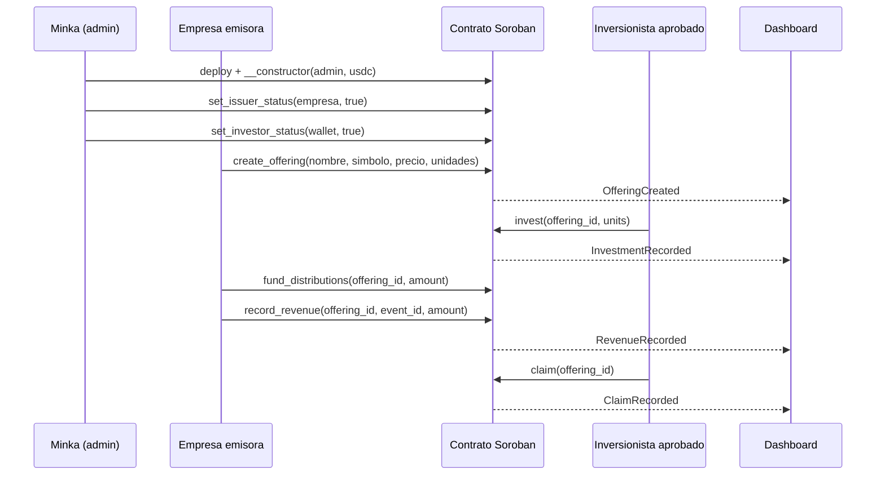

# Minka Capital

> Mercado primario simulado para notas de participacion en ingresos de startups peruanas, construido sobre Stellar/Soroban.

**Demo en vivo:** https://minka-capital.a20212540.workers.dev (landing) y [`/app`](https://minka-capital.a20212540.workers.dev/app) (dashboard). Cloudflare Workers, Stellar Testnet; usa Freighter en Testnet.

**Minka Capital es un prototipo exclusivamente para Stellar Testnet.** Usa empresas, activos y montos ficticios; no constituye una oferta de valores, recomendacion de inversion, servicio de custodia ni producto para dinero real.

## Problema

Las startups peruanas suelen depender de financiamiento lento, poco transparente y con escasa trazabilidad para aportantes. A la vez, los mecanismos de participacion en ingresos requieren registrar aportes, eventos de facturacion y distribuciones de manera auditable.

## Propuesta

Minka Capital es una plataforma de mercado primario multi-oferta con tres roles:

| Rol | Que puede hacer |
| --- | --- |
| **Minka (admin de plataforma)** | Aprueba empresas emisoras (`set_issuer_status`) e inversionistas (`set_investor_status`, allowlist global tipo KYC demo). Puede pausar cualquier oferta. |
| **Empresa emisora** | Publica ofertas de participacion en ingresos con nombre, simbolo, precio por unidad y unidades (`create_offering`); ajusta precio y unidades hasta la primera venta (`update_offering`); fondea distribuciones, registra ventas verificadas y retira el capital levantado. |
| **Inversionista aprobado** | Compra unidades de cualquier oferta con USDC Testnet (`invest`) y reclama su retorno proporcional (`claim`). |

La oferta de ejemplo es **LUMI-RSN**, una nota ficticia de participacion en ingresos de la startup demo *LumiSolar Peru*.

El diseno apunta al track **Realtime Systems & High-Velocity Finance** mediante eventos on-chain, contabilidad proporcional por evento y un dashboard que se actualiza en vivo desde Stellar RPC.

## Flujo demo



Diagrama completo: [arquitectura y flujo](docs/architecture/minka-capital-system-flow.md).

## Integracion con Stellar

El contrato [`minka-market`](_scaffold_base/contracts/minka-market/src/lib.rs) se implementa en Rust con Soroban SDK y contiene:

- Constructor atomico (`__constructor(admin, usdc)`): la plataforma se configura en la misma transaccion del despliegue, sin ventana para que un tercero la inicialice.
- Multiples ofertas por contrato, cada una con su emisor, precio, unidades, posiciones y tesoreria propias (`get_offerings`, `get_offering`).
- Reglas de precio: la empresa puede corregir precio y unidades mientras no haya ventas; tras la primera venta el precio queda fijo (todos pagan igual) y solo se pueden ampliar unidades o pausar la oferta.
- Tesoreria segregada por oferta: capital levantado (`raised`), distribuciones fondeadas sin asignar (`available`) y distribuciones asignadas a inversionistas (`allocated`). Un mismo deposito no puede respaldar dos eventos de ingreso, los claims nunca usan capital y los fondos de una oferta nunca pagan a inversionistas de otra.
- `withdraw_raise` libera el capital levantado solo a la empresa emisora; el admin de Minka no puede retirarlo.
- Registro idempotente de ingresos por `(offering_id, event_id)`.
- Calculo proporcional con precision escalada y checkpoints por posicion (un inversionista tardio no cobra ingresos previos). El redondeo de la division pro-rata deja un residuo minimo en `allocated`.
- Extension de TTL del almacenamiento en cada operacion para que el estado no se archive durante la demo.
- Eventos Soroban: `IssuerStatusChanged`, `InvestorStatusChanged`, `OfferingCreated`, `OfferingUpdated`, `OfferingPauseChanged`, `InvestmentRecorded`, `RaiseWithdrawn`, `DistributionFunded`, `RevenueRecorded` y `ClaimRecorded`.

El dashboard React/Vite en [`_scaffold_base/app`](_scaffold_base/app) lee el contrato con `contract.Client.from` (sin bindings generados) y muestra el catalogo de ofertas, la posicion del inversionista, la consola de la empresa emisora, la consola de Minka y un feed de eventos en vivo via `getEvents`.

### Estado actual del MVP

| Componente | Estado |
| --- | --- |
| Contrato multi-oferta, roles, allowlist y reparto proporcional | Implementado con 27 pruebas unitarias |
| Eventos Soroban para indexacion | Implementado |
| Dashboard React | Catalogo, invest/claim firmados, consolas de empresa y de Minka, feed en vivo |
| Transferencias reales de USDC Testnet mediante SAC | Implementado |
| Despliegue en Testnet | Desplegado con demo completa ejecutada (ver IDs y transacciones abajo) |

## Evidencia verificable

Las pruebas cubren:

1. Constructor, aprobacion de emisores y publicacion de ofertas con ids secuenciales.
2. Validacion de metadatos (precio cero, simbolo de mas de 12 caracteres) y rechazo de empresas no aprobadas.
3. Edicion libre antes de la primera venta; precio bloqueado y oferta que solo puede crecer despues.
4. Escrow del pago al precio de cada oferta y distribucion pro-rata 60/40 con transferencia SAC.
5. Aislamiento entre ofertas: tesorerias, posiciones y `event_id` independientes.
6. Checkpoints: un inversionista tardio no recibe ingresos anteriores.
7. Tesoreria segregada: un deposito no respalda dos ingresos, los claims no usan capital y solo el emisor retira el capital.
8. Pausa por emisor o por Minka sin bloquear claims.
9. Rechazo de inversionistas no aprobados, sobreasignacion, roles incorrectos, eventos duplicados, ofertas inexistentes y claims vacios.

Ejecutar (27 pruebas, todas en verde el 25 de septiembre de 2026):

```powershell
cd _scaffold_base
cargo test -p minka-market
```

En Windows con Control de aplicaciones inteligente activo, los build scripts de Cargo pueden quedar bloqueados. Alternativa con Docker:

```powershell
cd _scaffold_base
docker run --rm -v "${PWD}:/work" -v minka-target:/target -e CARGO_TARGET_DIR=/target -w /work rust:1.93 cargo test -p minka-market
docker run --rm -v "${PWD}:/work" -v minka-target:/target -e CARGO_TARGET_DIR=/target -w /work rust:1.93 cargo build -p minka-market --target wasm32v1-none --release
```

Los errores del contrato se exponen como codigos estables `Error(Contract, #n)` (`InvestorNotApproved = 4`, `IssuerNotApproved = 13`, `OfferingLocked = 16`, etc.) que el dashboard traduce a mensajes legibles.

## Ejecutar localmente

### Requisitos

- Rust `1.93` (el proyecto lo fija con `rust-toolchain.toml`) o Docker. En Linux tambien hace falta un compilador C para enlazar (`sudo apt install build-essential`).
- Node.js 22+ y npm.
- Stellar CLI (o la imagen Docker `stellar/stellar-cli`) para desplegar.

### Contrato

Los mismos comandos funcionan en PowerShell y en bash:

```bash
cd _scaffold_base
cargo test -p minka-market
cargo build -p minka-market --target wasm32v1-none --release
```

### Dashboard

```powershell
cd _scaffold_base
npm install
copy app\.env.example app\.env   # completar PUBLIC_MINKA_MARKET_ID, PUBLIC_USDC_SAC_ID, PUBLIC_MINKA_START_LEDGER
cd app
npx vite
```

En Linux/macOS, `cp app/.env.example app/.env`. Para usar el contrato oficial basta con copiar los valores de `app/.env.production`, que ya apunta al despliegue de la tabla de abajo.

Despliegue del dashboard en Cloudflare Workers (sitio estatico con fallback SPA, configurado en `app/wrangler.jsonc` y `app/.env.production`):

```powershell
cd _scaffold_base\app
npx wrangler login   # una sola vez
npm run deploy
```

La URL publica se construye con `app/.env.production`: si cambias de contrato, actualiza ese archivo y vuelve a ejecutar `npm run deploy` (la cuenta de Cloudflare es la de Leo; otro miembro puede desplegar en la suya y la URL cambiara).

`npm run dev` tambien lanza `stellar scaffold watch` para una red local; para usar el contrato de Testnet basta con Vite.

## Despliegue Testnet

Contrato multi-oferta desplegado el 25 de septiembre de 2026 (ledger 4870111) y demo completa ejecutada con USDC Testnet de Circle. Todos los identificadores son verificables en Stellar Expert:

| Recurso | Valor |
| --- | --- |
| Red | Stellar Testnet |
| Contrato `minka-market` | [`CDQ7YOMBZVPI3QPC7NTKHKQ57MKYFWSEJJBKC5KVGHQU3X6BZ5MQXWZ5`](https://stellar.expert/explorer/testnet/contract/CDQ7YOMBZVPI3QPC7NTKHKQ57MKYFWSEJJBKC5KVGHQU3X6BZ5MQXWZ5) |
| SAC USDC Testnet (Circle) | [`CBIELTK6YBZJU5UP2WWQEUCYKLPU6AUNZ2BQ4WWFEIE3USCIHMXQDAMA`](https://stellar.expert/explorer/testnet/contract/CBIELTK6YBZJU5UP2WWQEUCYKLPU6AUNZ2BQ4WWFEIE3USCIHMXQDAMA) |
| Admin de Minka | `GDD2SF6X2LCDKUTCGFYGO2ZT2RLRK4S2DRBST35REN2WYZAUQOAF7YE2` |
| Empresa emisora demo (LumiSolar) | `GBM4UZQ32XGNEJELA7ZRCXZGK7PFBXZHKPZO4MM5EUB2B2CLF63JX3OX` |
| Inversionista demo Ana | `GB5B6PYYXT7QOSUTXGIMFB5X3DQXL63YZREMQKS4MXVY4MAEKTS5BHKH` |
| Inversionista demo Luis | `GAQYU3BEVUVI2ATUTRQHEJMVQNGVNCNKKB4WOFYSEBWXC6B32OFN3DHM` |
| Empresa emisora del equipo (Leo) | `GD3LSZMCIBURLOZRQZ6BODBGGMIILKKU5LVXDLZYDM32J3RD366A3I53`, aprobada en [`da9979e0…`](https://stellar.expert/explorer/testnet/tx/da9979e050df75c522bbbe61ec4280fcd2c35bee236afa046cea9fc1e2912f14) |

Las claves secretas de las identidades demo (`minka-admin`, `lumisolar`, `ana`, `luis`) estan en la configuracion de Stellar CLI de la maquina que ejecuto el script, nunca en el repositorio.

### Transacciones de la demo

Oferta `LUMI-RSN` (id 0): 10 USDC por unidad, 1000 unidades. Ana compra 6 unidades y Luis 4 (100 USDC levantados); LumiSolar fondea y registra 20 USDC de ingresos y Ana reclama su 60 % (12 USDC). Los 8 USDC de Luis quedan asignados y reclamables.

| Paso | Transaccion |
| --- | --- |
| 1. Despliegue + constructor | [`0d60384a…`](https://stellar.expert/explorer/testnet/tx/0d60384adf13ad077f43f9a0f3e02059e633ef13ff1eba1e3fc29319621e9a50) |
| 2. Minka aprueba a LumiSolar como emisora | [`b39cc18c…`](https://stellar.expert/explorer/testnet/tx/b39cc18c0306a4662718491d8c9749c8a03daf2652f2cbdce82c69d352d78615) |
| 2. Minka aprueba a Ana | [`ece8c383…`](https://stellar.expert/explorer/testnet/tx/ece8c38370d0e73b4ed51e2ef26649b865bf542bdb4442c73712e3be713fb936) |
| 2. Minka aprueba a Luis | [`1980a214…`](https://stellar.expert/explorer/testnet/tx/1980a21447dfda2bc7ac013f368f368d78463a5561209b737a98148f50c8ef9f) |
| 3. LumiSolar publica LUMI-RSN | [`e11dbba5…`](https://stellar.expert/explorer/testnet/tx/e11dbba5a25708a24a90c49c5c7897493ffc13325a4704c9a9ebb0fdd1cb8e4a) |
| 4. Ana invierte 6 unidades (60 USDC) | [`1fa24d5a…`](https://stellar.expert/explorer/testnet/tx/1fa24d5ad6d6ff483e868c696a78f3fa3cb1fd3238f625ea8ed374a2d44abfe8) |
| 4. Luis invierte 4 unidades (40 USDC) | [`6165c387…`](https://stellar.expert/explorer/testnet/tx/6165c3875e2e8ba60129a69dd773b655566ed2639126af754559e7f9a8ede512) |
| 5. LumiSolar fondea 20 USDC | [`9ca853e9…`](https://stellar.expert/explorer/testnet/tx/9ca853e920f8f6b07da46277d578e51c80026bd3c8ccc0ba578009c51f7367fa) |
| 5. LumiSolar registra ingreso (evento 1, 20 USDC) | [`92ea0ced…`](https://stellar.expert/explorer/testnet/tx/92ea0cede6fbe0a493c185273d4c72b329283877ddbc7b310572018688ac16aa) |
| 6. Ana reclama 12 USDC | [`3ef55a8c…`](https://stellar.expert/explorer/testnet/tx/3ef55a8cc4b6f7186754cdc94ac856607587030cf231097f434b282ca3460bf1) |

Versiones anteriores: multi-oferta sin demo completa [`CD4QCMLV…K2WI7`](https://stellar.expert/explorer/testnet/contract/CD4QCMLVUWY74ZDGCQCHIYNJ6BJRXSOEJHURJKQH6YLBFDMZIK3K2WI7); una sola oferta [`CDEJ6W6K…DMFMM`](https://stellar.expert/explorer/testnet/contract/CDEJ6W6KLXH5YCHZTGOHDWYNQ3YNWQZOJZDJHJHIEWYF7Z5YNVIDMFMM).

### Reproducir el despliegue

**Linux / macOS / WSL (demo completa en un comando).** Crea las cuatro identidades con friendbot, compra USDC de Circle en el DEX de Testnet (XLM -> USDC), despliega el contrato y ejecuta los pasos 1-6. Los hashes quedan en `demo-testnet.log` y el dashboard local queda configurado en `app/.env.local`:

```bash
cd _scaffold_base
./scripts/demo-minka-testnet.sh
# o, contra un contrato ya desplegado:
MINKA_MARKET_ID=C... ./scripts/demo-minka-testnet.sh
```

Todas las opciones se pueden cambiar con variables de entorno (`USDC_ISSUER`, `USDC_SAC_ID`, `ADMIN`, `ISSUER`, `ANA`, `LUIS`, `UNIT_PRICE_USDC`, `TARGET_UNITS`, `ANA_UNITS`, `LUIS_UNITS`, `REVENUE_USDC`, `REVENUE_EVENT_ID`); ver la cabecera del script.

**Windows (solo despliegue).** Con una identidad de Stellar CLI fondeada en Testnet (`stellar keys generate admin --network testnet --fund`):

```powershell
cd _scaffold_base
.\scripts\deploy-minka-testnet.ps1 -AdminAlias admin -UsdcSacId CBIELTK6YBZJU5UP2WWQEUCYKLPU6AUNZ2BQ4WWFEIE3USCIHMXQDAMA
```

Despues, Minka aprueba a la empresa y a los inversionistas desde su consola en el dashboard (o con `set_issuer_status` / `set_investor_status`), y la empresa publica su oferta desde la consola de emisora. Copia `app/.env.example` a `app/.env` y completa `PUBLIC_MINKA_MARKET_ID`, `PUBLIC_USDC_SAC_ID` y `PUBLIC_MINKA_START_LEDGER`.

## Pitch y video

- [Guion del pitch de 2 minutos](docs/pitch.md): problema, solución y visión, con preguntas probables del jurado.
- [Instructivo para grabar el video](docs/video-demo.md): de un clon limpio a la grabación con OBS, en cualquier máquina.

## Guion de la demo en el dashboard

Pensado para el video de dos minutos sobre el contrato oficial, donde la demo por CLI ya dejo historial en el feed y **8 USDC reclamables para Luis**, para mostrar un claim en vivo.

1. **Preparar Freighter en Testnet.** Importa las identidades demo que vayas a usar. En la maquina que ejecuto el script, `stellar keys secret luis` imprime la clave de Luis; pegala directamente en Freighter (*Import wallet*) y no la compartas por chat. Repite con `lumisolar` y `minka-admin` si vas a mostrar sus consolas.
2. **Abrir con la landing** (`/`): el globo de Peru y las metricas en vivo leidas del contrato. Luego **presentar el catalogo** en `/app` (sin wallet): `LUMI-RSN` con 10 de 1000 unidades vendidas, 100 USDC levantados, y el feed con despliegue, aprobaciones, inversiones, ingreso y claim, cada uno con su hash.
3. **Claim en vivo como Luis:** conecta su wallet, el panel del inversionista muestra 4 unidades y 8 USDC reclamables; en la pestaña *Mi portafolio* pulsa *Cobrar 8 USDC*. El evento `Claim` aparece en el feed en segundos (track Realtime).
4. **Nuevo ingreso como LumiSolar:** en la consola de empresa emisora, fondea distribuciones y pulsa *Registrar ingreso* (el dashboard genera un `event_id` unico). LumiSolar necesita USDC: puede sacar parte del capital levantado con *Retirar capital*, o pedirlo al faucet de Circle (faucet.circle.com). El saldo reclamable de Ana y Luis sube en vivo.
5. **Reglas on-chain:** en la consola de LumiSolar, `LUMI-RSN` aparece como *precio fijo* porque ya tiene ventas: el precio no se puede editar y las unidades solo pueden crecer (el contrato lo impone con `OfferingLocked`). Ampliar las unidades si funciona. El rechazo de `event_id` duplicados esta cubierto por las pruebas del contrato.
6. **Cierre con la consola de Minka:** aprobar una empresa o inversionista nuevo y mostrar la transaccion en Stellar Expert.

Stellar RPC conserva unos 7 dias de eventos. Despues de ese plazo el feed muestra un aviso y la historia completa sigue en la pagina del contrato en Stellar Expert y en la tabla de transacciones de arriba.

## Roadmap inmediato

1. Grabar el video demo de dos minutos.
2. Sustituir el registro manual de ingresos por un oraculo firmado conectado a POS o facturacion.

## Estructura

```text
docs/architecture/            Arquitectura y flujo del sistema
docs/specs/                   Especificacion del MVP
docs/pitch.md                 Guion del pitch (2 min)
docs/video-demo.md            Instructivo para grabar el video demo
docs/archive/                 Planes originales (historico)
_scaffold_base/
  scripts/                    Demo Testnet (bash) y despliegue (PowerShell)
  contracts/minka-market/     Contrato Soroban y pruebas
  app/                        Landing (/) y dashboard (/app) en React/Vite
  app-lib/                    Utilidades y clientes de Stellar Scaffold
```

## Licencia

El scaffold base conserva la licencia Apache-2.0 de Stellar Scaffold. El codigo especifico de Minka Capital se publica bajo la misma licencia salvo que el equipo establezca otra antes de la entrega.
