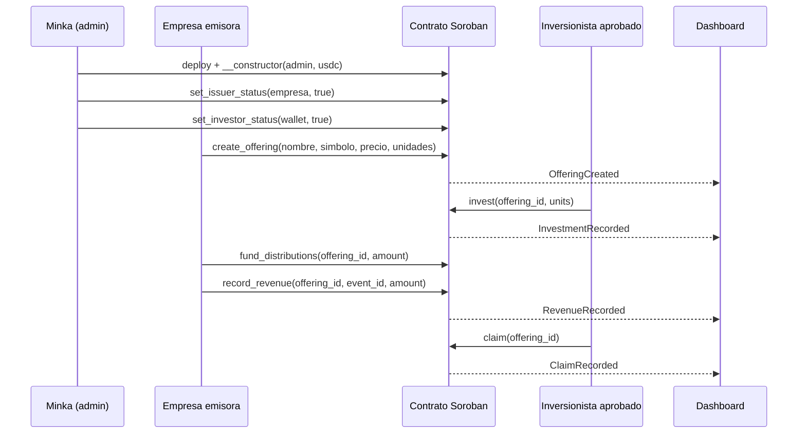

# Minka Capital

> Mercado primario simulado para notas de participacion en ingresos de startups peruanas, construido sobre Stellar/Soroban.

**Minka Capital es un prototipo exclusivamente para Stellar Testnet.** Usa empresas, activos y montos ficticios; no constituye una oferta de valores, recomendacion de inversion, servicio de custodia ni producto para dinero real.

## Problema

Las startups peruanas suelen depender de financiamiento lento, poco transparente y con escasa trazabilidad para aportantes. A la vez, los mecanismos de participacion en ingresos requieren registrar aportes, eventos de facturacion y distribuciones de manera auditable.

## Propuesta

Minka Capital es una plataforma de mercado primario multi-oferta con tres roles:

| Rol | Que puede hacer |
| --- | --- |
| **Minka (admin de plataforma)** | Aprueba empresas emisoras (`set_issuer_status`) e inversionistas (`set_investor_status`, allowlist global tipo KYC demo). Puede pausar cualquier oferta. |
| **Empresa emisora** | Publica ofertas de participacion en ingresos con nombre, simbolo, precio por unidad y unidades (`create_offering`); ajusta precio y unidades hasta la primera venta (`update_offering`); fondea distribuciones, registra ventas verificadas y retira el capital levantado. |
| **Inversionista aprobado** | Compra unidades de cualquier oferta con USDC Testnet (`invest`) y reclama su retorno proporcional (`claim`). |

La oferta de ejemplo es **LUMI-RSN**, una nota ficticia de participacion en ingresos de la startup demo *LumiSolar Peru*.

El diseno apunta al track **Realtime Systems & High-Velocity Finance** mediante eventos on-chain, contabilidad proporcional por evento y un dashboard que se actualiza en vivo desde Stellar RPC.

## Flujo demo



Diagrama completo: [arquitectura y flujo](docs/architecture/minka-capital-system-flow.md).

## Integracion con Stellar

El contrato [`minka-market`](_scaffold_base/contracts/minka-market/src/lib.rs) se implementa en Rust con Soroban SDK y contiene:

- Constructor atomico (`__constructor(admin, usdc)`): la plataforma se configura en la misma transaccion del despliegue, sin ventana para que un tercero la inicialice.
- Multiples ofertas por contrato, cada una con su emisor, precio, unidades, posiciones y tesoreria propias (`get_offerings`, `get_offering`).
- Reglas de precio: la empresa puede corregir precio y unidades mientras no haya ventas; tras la primera venta el precio queda fijo (todos pagan igual) y solo se pueden ampliar unidades o pausar la oferta.
- Tesoreria segregada por oferta: capital levantado (`raised`), distribuciones fondeadas sin asignar (`available`) y distribuciones asignadas a inversionistas (`allocated`). Un mismo deposito no puede respaldar dos eventos de ingreso, los claims nunca usan capital y los fondos de una oferta nunca pagan a inversionistas de otra.
- `withdraw_raise` libera el capital levantado solo a la empresa emisora; el admin de Minka no puede retirarlo.
- Registro idempotente de ingresos por `(offering_id, event_id)`.
- Calculo proporcional con precision escalada y checkpoints por posicion (un inversionista tardio no cobra ingresos previos). El redondeo de la division pro-rata deja un residuo minimo en `allocated`.
- Extension de TTL del almacenamiento en cada operacion para que el estado no se archive durante la demo.
- Eventos Soroban: `IssuerStatusChanged`, `InvestorStatusChanged`, `OfferingCreated`, `OfferingUpdated`, `OfferingPauseChanged`, `InvestmentRecorded`, `RaiseWithdrawn`, `DistributionFunded`, `RevenueRecorded` y `ClaimRecorded`.

El dashboard React/Vite en [`_scaffold_base/app`](_scaffold_base/app) lee el contrato con `contract.Client.from` (sin bindings generados) y muestra el catalogo de ofertas, la posicion del inversionista, la consola de la empresa emisora, la consola de Minka y un feed de eventos en vivo via `getEvents`.

### Estado actual del MVP

| Componente | Estado |
| --- | --- |
| Contrato multi-oferta, roles, allowlist y reparto proporcional | Implementado con 27 pruebas unitarias |
| Eventos Soroban para indexacion | Implementado |
| Dashboard React | Catalogo, invest/claim firmados, consolas de empresa y de Minka, feed en vivo |
| Transferencias reales de USDC Testnet mediante SAC | Implementado |
| Despliegue en Testnet | Desplegado (ver IDs abajo) |

## Evidencia verificable

Las pruebas cubren:

1. Constructor, aprobacion de emisores y publicacion de ofertas con ids secuenciales.
2. Validacion de metadatos (precio cero, simbolo de mas de 12 caracteres) y rechazo de empresas no aprobadas.
3. Edicion libre antes de la primera venta; precio bloqueado y oferta que solo puede crecer despues.
4. Escrow del pago al precio de cada oferta y distribucion pro-rata 60/40 con transferencia SAC.
5. Aislamiento entre ofertas: tesorerias, posiciones y `event_id` independientes.
6. Checkpoints: un inversionista tardio no recibe ingresos anteriores.
7. Tesoreria segregada: un deposito no respalda dos ingresos, los claims no usan capital y solo el emisor retira el capital.
8. Pausa por emisor o por Minka sin bloquear claims.
9. Rechazo de inversionistas no aprobados, sobreasignacion, roles incorrectos, eventos duplicados, ofertas inexistentes y claims vacios.

Ejecutar (27 pruebas, todas en verde el 25 de septiembre de 2026):

```powershell
cd _scaffold_base
cargo test -p minka-market
```

En Windows con Control de aplicaciones inteligente activo, los build scripts de Cargo pueden quedar bloqueados. Alternativa con Docker:

```powershell
cd _scaffold_base
docker run --rm -v "${PWD}:/work" -v minka-target:/target -e CARGO_TARGET_DIR=/target -w /work rust:1.93 cargo test -p minka-market
docker run --rm -v "${PWD}:/work" -v minka-target:/target -e CARGO_TARGET_DIR=/target -w /work rust:1.93 cargo build -p minka-market --target wasm32v1-none --release
```

Los errores del contrato se exponen como codigos estables `Error(Contract, #n)` (`InvestorNotApproved = 4`, `IssuerNotApproved = 13`, `OfferingLocked = 16`, etc.) que el dashboard traduce a mensajes legibles.

## Ejecutar localmente

### Requisitos

- Rust `1.93` (el proyecto lo fija con `rust-toolchain.toml`) o Docker.
- Node.js 22+ y npm.
- Stellar CLI (o la imagen Docker `stellar/stellar-cli`) para desplegar.

### Contrato

```powershell
cd _scaffold_base
cargo test -p minka-market
cargo build -p minka-market --target wasm32v1-none --release
```

### Dashboard

```powershell
cd _scaffold_base
npm install
copy app\.env.example app\.env   # completar PUBLIC_MINKA_MARKET_ID, PUBLIC_USDC_SAC_ID, PUBLIC_MINKA_START_LEDGER
cd app
npx vite
```

`npm run dev` tambien lanza `stellar scaffold watch` para una red local; para usar el contrato de Testnet basta con Vite.

## Despliegue Testnet

Contrato multi-oferta desplegado el 25 de septiembre de 2026 (ledger 4869273). Todos los identificadores son verificables en Stellar Expert:

| Recurso | Valor |
| --- | --- |
| Red | Stellar Testnet |
| Contrato `minka-market` | [`CD4QCMLVUWY74ZDGCQCHIYNJ6BJRXSOEJHURJKQH6YLBFDMZIK3K2WI7`](https://stellar.expert/explorer/testnet/contract/CD4QCMLVUWY74ZDGCQCHIYNJ6BJRXSOEJHURJKQH6YLBFDMZIK3K2WI7) |
| SAC USDC Testnet (Circle) | [`CBIELTK6YBZJU5UP2WWQEUCYKLPU6AUNZ2BQ4WWFEIE3USCIHMXQDAMA`](https://stellar.expert/explorer/testnet/contract/CBIELTK6YBZJU5UP2WWQEUCYKLPU6AUNZ2BQ4WWFEIE3USCIHMXQDAMA) |
| Admin de Minka | `GCKT2QQJWB5EZSFN22AU33NTRGSK5SUK44BHV75MYGLM5Y67NPLPCZFJ` |
| Empresa emisora demo (LumiSolar) | `GDLO26OC4T7HITSVQHHWP5OILUP5472RPL6MNPIW2JOT3HMNGZD7JQEC` |
| Inversionista demo Ana | `GC7PF3RLPCULFFF27AY7IDDMRU5DJ527XJOFVMUMGLFZ7Q4HUO5IHLX7` |
| Inversionista demo Luis | `GDSDTSZUODLBQOIC3JGJVX6QGRQA32EBQYCXZQLBEHTSKLE3OXIMLRXN` |

### Transacciones de la demo

| Paso | Transaccion |
| --- | --- |
| 1. Despliegue + constructor | [`b1b1f607…`](https://stellar.expert/explorer/testnet/tx/b1b1f607424bfa5fa7d5dfbec3d367c24069be105ca0d5dded6589bad4a7dd37) |
| 2. Minka aprueba a LumiSolar como emisora | [`c4c3f16f…`](https://stellar.expert/explorer/testnet/tx/c4c3f16f8f2ac907ae4885eb42ba7d4f318134e3e1aa3f9f6855fbeb3e9e7ae0) |
| 2. Minka aprueba a Ana | [`ed348f30…`](https://stellar.expert/explorer/testnet/tx/ed348f30332d7fc6f15fa62cee29986f19c31cfae18b09989c5b1d23faa75cba) |
| 2. Minka aprueba a Luis | [`4408597d…`](https://stellar.expert/explorer/testnet/tx/4408597dcf76171f53860a04bf3e74b430ab307e199a3dd76cc14418a7ac9b62) |
| 3. LumiSolar publica LUMI-RSN | pendiente |
| 4. Inversiones de Ana y Luis | pendiente |
| 5. Fondeo + registro de ingreso | pendiente |
| 6. Claim de Ana | pendiente |

Version anterior (una sola oferta, reemplazada por el modelo multi-oferta): [`CDEJ6W6K…DMFMM`](https://stellar.expert/explorer/testnet/contract/CDEJ6W6KLXH5YCHZTGOHDWYNQ3YNWQZOJZDJHJHIEWYF7Z5YNVIDMFMM).

### Reproducir el despliegue

Con una identidad de Stellar CLI fondeada en Testnet (`stellar keys generate admin --network testnet --fund`):

```powershell
cd _scaffold_base
.\scripts\deploy-minka-testnet.ps1 -AdminAlias admin -UsdcSacId CBIELTK6YBZJU5UP2WWQEUCYKLPU6AUNZ2BQ4WWFEIE3USCIHMXQDAMA
```

Despues, Minka aprueba a la empresa y a los inversionistas desde su consola en el dashboard (o con `set_issuer_status` / `set_investor_status`), y la empresa publica su oferta desde la consola de emisora. Copia `app/.env.example` a `app/.env` y completa `PUBLIC_MINKA_MARKET_ID`, `PUBLIC_USDC_SAC_ID` y `PUBLIC_MINKA_START_LEDGER`.

## Roadmap inmediato

1. Ejecutar la demo completa en Testnet (publicacion, inversiones, ingreso y claim) y registrar sus transacciones.
2. Grabar el video demo de dos minutos.
3. Sustituir el registro manual de ingresos por un oraculo firmado conectado a POS o facturacion.

## Estructura

```text
docs/                         Propuesta, plan y arquitectura
_scaffold_base/
  contracts/minka-market/     Contrato Soroban y pruebas
  app/                        Dashboard React/Vite
  app-lib/                    Utilidades y clientes de Stellar Scaffold
```

## Licencia

El scaffold base conserva la licencia Apache-2.0 de Stellar Scaffold. El codigo especifico de Minka Capital se publica bajo la misma licencia salvo que el equipo establezca otra antes de la entrega.
