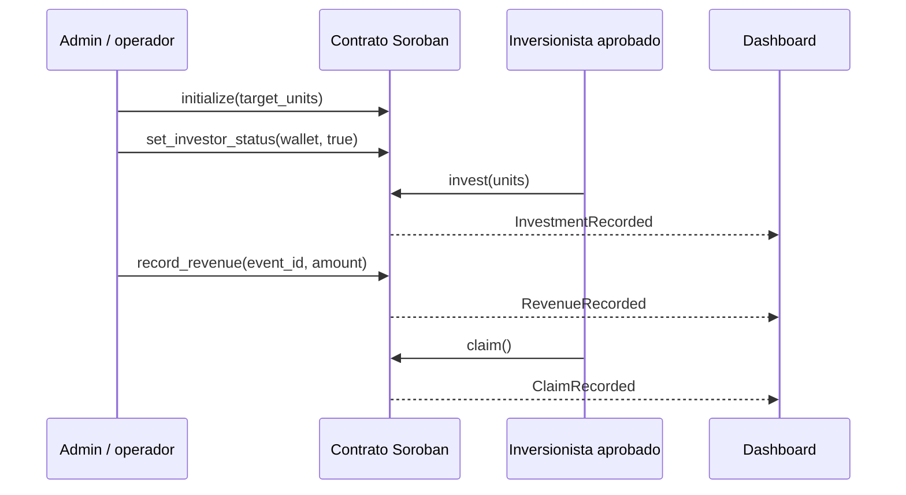

# Minka Capital

> Mercado primario simulado para notas de participacion en ingresos de startups peruanas, construido sobre Stellar/Soroban.

**Minka Capital es un prototipo exclusivamente para Stellar Testnet.** Usa empresas, activos y montos ficticios; no constituye una oferta de valores, recomendacion de inversion, servicio de custodia ni producto para dinero real.

## Problema

Las startups peruanas suelen depender de financiamiento lento, poco transparente y con escasa trazabilidad para aportantes. A la vez, los mecanismos de participacion en ingresos requieren registrar aportes, eventos de facturacion y distribuciones de manera auditable.

## Propuesta

Minka Capital modela una emision primaria ficticia: **LUMI-RSN**, una nota de participacion en ingresos de la startup demo *LumiSolar Peru*. Las wallets aprobadas adquieren unidades; un administrador registra eventos de ingresos idempotentes; y cada wallet puede consultar y reclamar su monto proporcional.

El diseno apunta al track **Realtime Systems & High-Velocity Finance** mediante eventos on-chain, contabilidad proporcional por evento e infraestructura preparada para actualizar el dashboard desde Stellar RPC.

## Flujo demo



Diagrama completo: [arquitectura y flujo](docs/architecture/minka-capital-system-flow.md).

## Integracion con Stellar

El contrato [`minka-market`](_scaffold_base/contracts/minka-market/src/lib.rs) se implementa en Rust con Soroban SDK y contiene:

- Allowlist de wallets mediante `set_investor_status`.
- Limite de unidades de la oferta y control de sobreasignacion.
- Registro idempotente de ingresos por `event_id`.
- Calculo proporcional con precision escalada y checkpoints por posicion.
- Eventos Soroban: `OfferingCreated`, `InvestorStatusChanged`, `InvestmentRecorded`, `RevenueRecorded` y `ClaimRecorded`.
- Autorizacion de la wallet para invertir/reclamar y del administrador para operaciones privilegiadas.

La interfaz React/Vite inicial esta en [`_scaffold_base/app`](_scaffold_base/app) y muestra el dashboard de la oferta, posicion, tesoreria y feed de eventos.

### Estado actual del MVP

| Componente | Estado |
| --- | --- |
| Contrato de oferta, allowlist y reparto proporcional | Implementado y con pruebas unitarias |
| Eventos Soroban para indexacion | Implementado |
| Dashboard React | Implementado con datos demo |
| Transferencias reales de USDC Testnet mediante SAC | Siguiente hito |
| Wallet, cliente generado y despliegue en Testnet | Siguiente hito |

Por transparencia: `claim()` hoy liquida la contabilidad y emite el evento, pero aun **no** ejecuta una transferencia USDC. Esa integracion se incorporara conectando el Stellar Asset Contract (SAC) de USDC en Testnet antes de la demo final.

## Evidencia verificable

Las pruebas cubren:

1. Distribucion pro-rata 60/40 y reinicio del saldo tras `claim`.
2. Rechazo de wallets no aprobadas.
3. Rechazo de eventos de ingreso duplicados.

Ejecutadas localmente con exito el 23 de septiembre de 2026:

```powershell
cd _scaffold_base
cargo test -p minka-market
```

## Ejecutar localmente

### Requisitos

- Rust `1.93` (el proyecto lo fija con `rust-toolchain.toml`).
- Node.js 22+ y npm.
- Stellar CLI.
- Stellar Scaffold CLI.

### Contrato

```powershell
cd _scaffold_base
cargo test -p minka-market
cargo build -p minka-market --target wasm32v1-none --release
```

### Dashboard

```powershell
cd _scaffold_base
npm install
npm run dev
```

## Despliegue Testnet (pendiente de registrar)

Antes de la presentacion se publicaran aqui los identificadores verificables:

| Recurso | Valor |
| --- | --- |
| Red | Stellar Testnet |
| Contrato `minka-market` | `PENDIENTE_DE_DESPLIEGUE` |
| SAC USDC Testnet | `PENDIENTE_DE_CONFIGURACION` |
| Wallet admin demo | `PENDIENTE_DE_FONDEO` |

Una vez configurados el alias, la cuenta administradora y el SAC, el flujo de Scaffold para publicar/desplegar parte de:

```powershell
cd _scaffold_base
stellar registry publish
stellar registry deploy --deployed-name minka-market --published-name minka-market
```

## Roadmap inmediato

1. Agregar el SAC de USDC Testnet al constructor y ejecutar cobro/reparto real.
2. Generar cliente TypeScript y conectar wallet + llamadas del dashboard.
3. Desplegar contrato y publicar IDs, transacciones y video demo verificables.
4. Consumir eventos por Stellar RPC para actualizar posiciones en tiempo casi real.

## Estructura

```text
docs/                         Propuesta, plan y arquitectura
_scaffold_base/
  contracts/minka-market/     Contrato Soroban y pruebas
  app/                        Dashboard React/Vite
  app-lib/                    Utilidades y clientes de Stellar Scaffold
```

## Licencia

El scaffold base conserva la licencia Apache-2.0 de Stellar Scaffold. El codigo especifico de Minka Capital se publica bajo la misma licencia salvo que el equipo establezca otra antes de la entrega.
