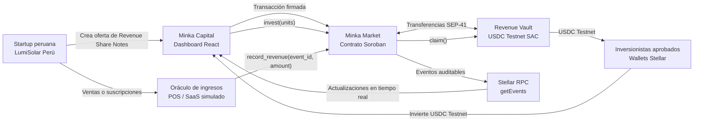
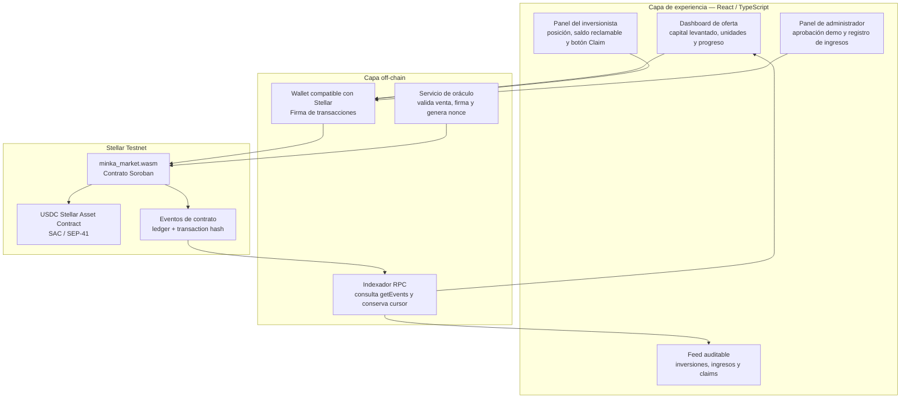
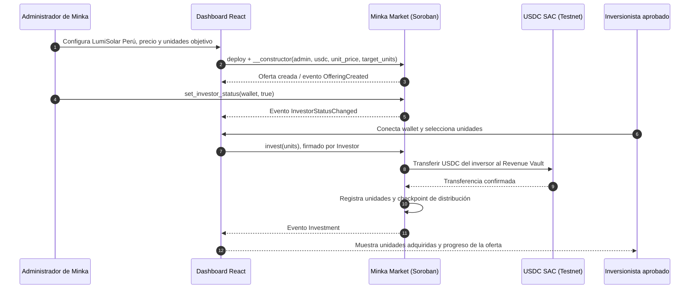
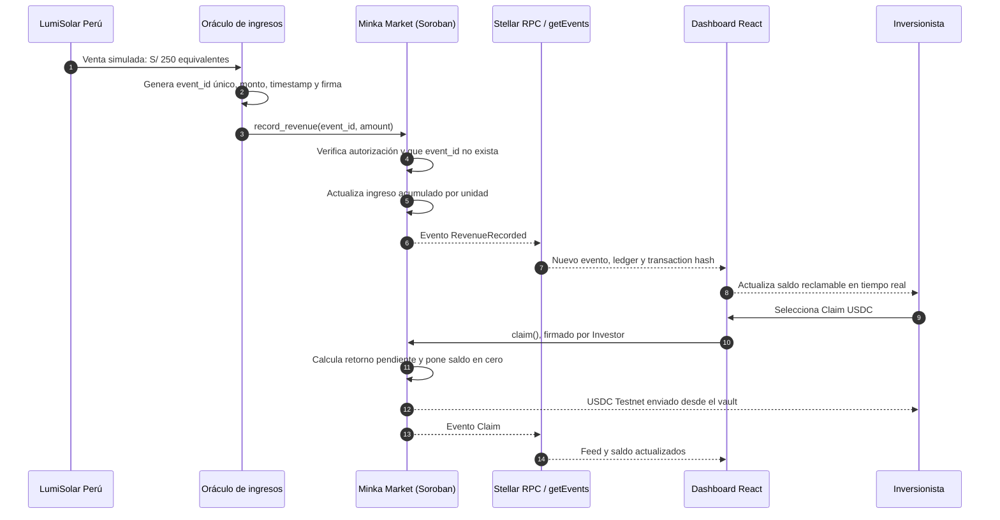
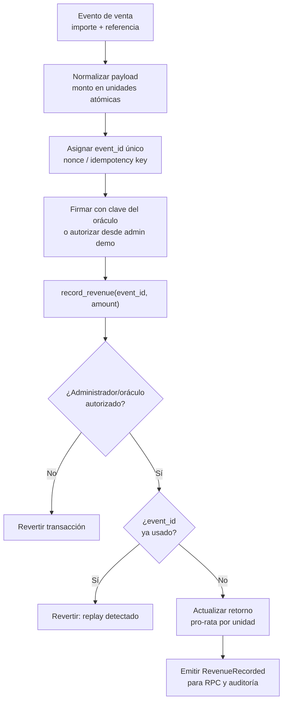
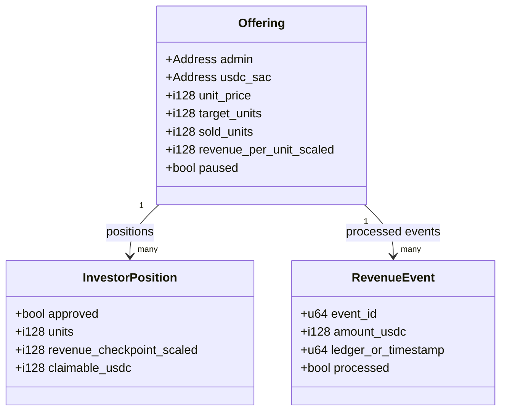
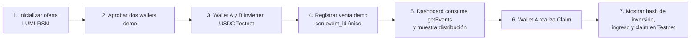
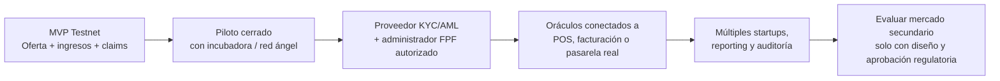

# Minka Capital — Esquema y flujo del sistema

> **Entorno:** Stellar Testnet exclusivamente.  
> **Aviso:** Este prototipo no ofrece valores reales, custodia, KYC real ni mercado secundario. Demuestra infraestructura para una futura plataforma de Financiamiento Participativo Financiero (FPF) regulada.

## 1. Visión del producto

Minka Capital permite que una startup peruana ficticia, **LumiSolar Perú**, cree una oferta primaria de participaciones simuladas en ingresos futuros (`LUMI-RSN`). Los inversionistas demo aprobados adquieren unidades usando USDC en Stellar Testnet. Cuando la startup reporta ventas, un oráculo autorizado registra eventos de ingreso; el contrato calcula el retorno proporcional y cada inversionista puede reclamar su USDC cuando lo decida.

## 2. Componentes y responsabilidades

| Componente | Responsabilidad en el MVP | Evidencia para el jurado |
|---|---|---|
| `minka_market` | Oferta, allowlist, unidades, eventos de ingresos, cálculo pro-rata y claims | WASM, Contract ID, tests Rust y transacciones Testnet |
| USDC SAC | Activo de pago y liquidación simulada | Transferencias verificables en Testnet |
| Oráculo demo | Convierte ventas simuladas en eventos firmados e idempotentes | `event_id`, timestamp y transacción `record_revenue` |
| Stellar RPC | Expone eventos del contrato para el dashboard | Feed con ledger, hash y tipo de evento |
| Dashboard | Muestra estado, retornos y trazabilidad | Demo grabada de punta a punta |

## 3. Flujo de emisión e inversión primaria

### Reglas on-chain aplicadas

1. Solo el administrador puede aprobar wallets y registrar ingresos.
2. Solo una wallet aprobada puede invertir.
3. No se permiten unidades ni montos menores o iguales a cero.
4. No se permite sobrepasar las unidades objetivo de la oferta.
5. Cada inversión registra un checkpoint: un inversionista nuevo no recibe ingresos generados antes de invertir.

## 4. Flujo de ingresos en tiempo real y distribución

### Protección del evento de ingresos

## 5. Datos principales del contrato

## 6. Escenario de demo y evidencia verificable

| Paso | Qué se verifica | Criterio de evaluación que fortalece |
|---|---|---|
| Inicialización | Contract ID y parámetros de la oferta | Integración técnica Stellar |
| Inversión | USDC, autorización de wallet y unidades registradas | Funcionalidad demostrable |
| Ingreso | `event_id` único, distribución pro-rata y evento on-chain | Realtime Systems & High-Velocity Finance |
| Claim | Transferencia de USDC Testnet y actualización de saldo | Funcionalidad demostrable |
| Feed RPC | Ledger, hash y eventos mostrados desde `getEvents` | Evidencia verificable |
| Límite regulatorio | Disclaimer y ruta FPF regulada | Viabilidad y continuidad |

## 7. Evolución posterior al hackathon

