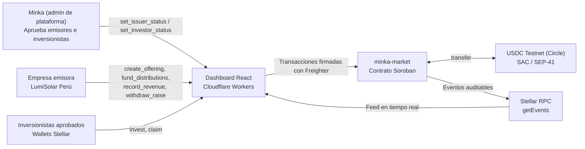
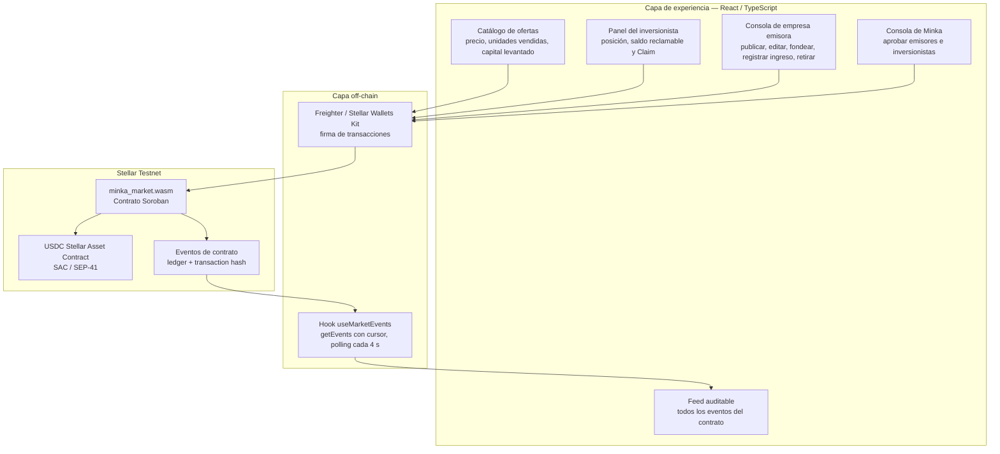
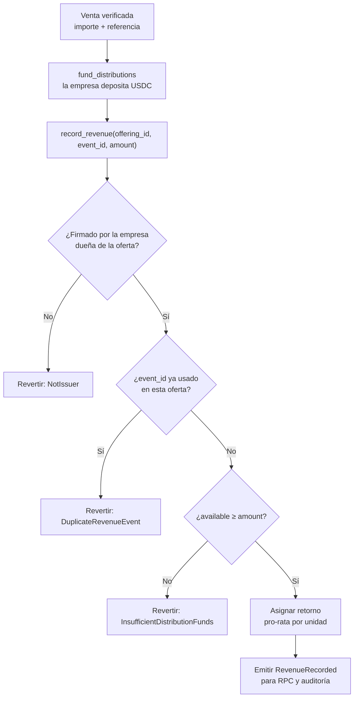
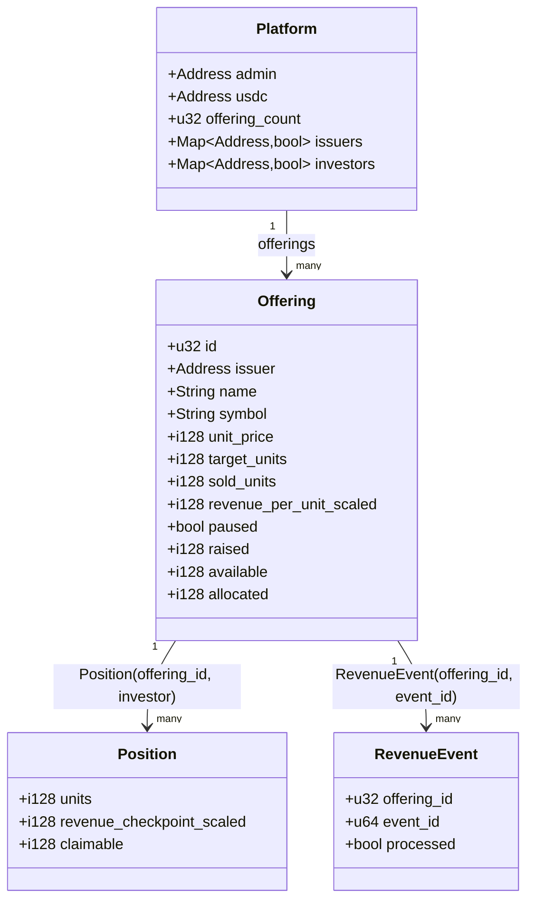
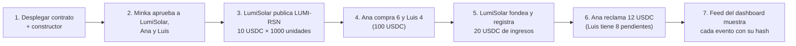
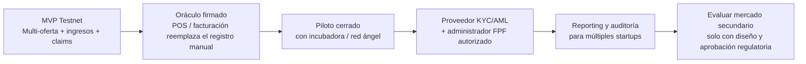

# Minka Capital — Esquema y flujo del sistema

> **Entorno:** Stellar Testnet exclusivamente.  
> **Aviso:** Este prototipo no ofrece valores reales, custodia, KYC real ni mercado secundario. Demuestra infraestructura para una futura plataforma de Financiamiento Participativo Financiero (FPF) regulada.

## 1. Visión del producto

Minka Capital es un mercado primario **multi-oferta**: empresas emisoras aprobadas por Minka publican notas simuladas de participación en ingresos futuros, y los inversionistas aprobados compran unidades con USDC en Stellar Testnet. Cuando una empresa reporta ventas, fondea y registra el ingreso en el contrato; el contrato asigna el retorno pro-rata y cada inversionista lo reclama cuando quiera.

La oferta de ejemplo es `LUMI-RSN`, de la startup ficticia **LumiSolar Perú**. En el MVP el ingreso lo registra la propia empresa emisora desde su wallet; un oráculo firmado conectado a POS o facturación es la siguiente etapa (sección 7).



## 2. Componentes y responsabilidades



| Componente | Responsabilidad en el MVP | Evidencia para el jurado |
|---|---|---|
| `minka-market` | Ofertas, roles, allowlist, tesorería segregada, cálculo pro-rata y claims | WASM, Contract ID, 27 tests Rust y transacciones Testnet |
| USDC SAC | Activo de pago y liquidación | Transferencias verificables en Testnet |
| Registro de ingresos | La empresa fondea y registra cada venta con un `event_id` idempotente | Transacciones `fund_distributions` y `record_revenue` |
| Stellar RPC | Expone eventos del contrato para el dashboard | Feed con ledger, hash y tipo de evento |
| Dashboard | Muestra estado, retornos y trazabilidad; firma con la wallet del usuario | Demo en vivo en Cloudflare y video |

### Retención de eventos

Stellar RPC en Testnet conserva unos **7 días** de eventos. El dashboard empieza a leer en `PUBLIC_MINKA_START_LEDGER` (el ledger del despliegue) o, si esa fecha ya salió de la ventana, en el ledger más antiguo que conserva el RPC. En ese caso muestra un aviso con enlace a Stellar Expert, donde la actividad anterior sigue verificable.

## 3. Flujo de alta, publicación e inversión primaria

```mermaid
sequenceDiagram
    autonumber
    participant Minka as Minka (admin)
    participant Empresa as Empresa emisora
    participant Contract as minka-market (Soroban)
    participant USDC as USDC SAC (Testnet)
    participant Investor as Inversionista

    Minka->>Contract: deploy + __constructor(admin, usdc)
    Minka->>Contract: set_issuer_status(empresa, true)
    Contract-->>Minka: IssuerStatusChanged
    Minka->>Contract: set_investor_status(wallet, true)
    Contract-->>Minka: InvestorStatusChanged

    Empresa->>Contract: create_offering(nombre, símbolo, precio, unidades)
    Contract-->>Empresa: offering_id + OfferingCreated
    opt Antes de la primera venta
        Empresa->>Contract: update_offering(precio, unidades)
        Contract-->>Empresa: OfferingUpdated
    end

    Investor->>Contract: invest(offering_id, units)
    Contract->>USDC: transfer(inversionista → contrato, units × precio)
    Contract->>Contract: raised += pago; checkpoint de la posición
    Contract-->>Investor: InvestmentRecorded

    Empresa->>Contract: withdraw_raise(offering_id, to, amount)
    Contract->>USDC: transfer(contrato → empresa, amount)
    Contract-->>Empresa: RaiseWithdrawn
```

### Reglas on-chain aplicadas

1. Solo el admin de Minka aprueba o revoca empresas emisoras e inversionistas (allowlist global tipo KYC demo).
2. Solo una empresa aprobada puede publicar ofertas; solo la empresa dueña de una oferta puede editarla, fondearla, registrar ingresos y retirar su capital.
3. Solo una wallet aprobada puede invertir, y no se pueden superar las unidades objetivo.
4. Precio y unidades se editan libremente hasta la primera venta. Después el precio queda fijo y las unidades solo pueden crecer.
5. La empresa o Minka pueden pausar una oferta; la pausa bloquea inversiones nuevas pero nunca los claims.
6. Cada inversión registra un checkpoint: un inversionista nuevo no recibe ingresos anteriores a su compra.
7. No se aceptan montos, precios ni unidades menores o iguales a cero; el nombre admite hasta 64 caracteres y el símbolo hasta 12.

## 4. Flujo de ingresos y distribución

```mermaid
sequenceDiagram
    autonumber
    participant Empresa as Empresa emisora
    participant Contract as minka-market (Soroban)
    participant USDC as USDC SAC (Testnet)
    participant RPC as Stellar RPC / getEvents
    participant UI as Dashboard React
    participant Investor as Inversionista

    Empresa->>Contract: fund_distributions(offering_id, amount)
    Contract->>USDC: transfer(empresa → contrato, amount)
    Contract->>Contract: available += amount
    Contract-->>RPC: DistributionFunded

    Empresa->>Contract: record_revenue(offering_id, event_id, amount)
    Contract->>Contract: Verifica emisor, event_id nuevo y available ≥ amount
    Contract->>Contract: available → allocated; revenue_per_unit += amount / sold_units
    Contract-->>RPC: RevenueRecorded
    RPC-->>UI: Nuevo evento con ledger y hash
    UI-->>Investor: Saldo reclamable actualizado

    Investor->>Contract: claim(offering_id)
    Contract->>Contract: Liquida la posición y pone claimable en cero
    Contract->>USDC: transfer(contrato → inversionista, claimable)
    Contract-->>RPC: ClaimRecorded
    RPC-->>UI: Feed y saldo actualizados
```

### Tesorería segregada por oferta

Cada USDC que el contrato custodia para una oferta está en uno solo de tres compartimentos:

| Compartimento | Entra por | Sale por |
|---|---|---|
| `raised` (capital levantado) | `invest` | `withdraw_raise`, solo hacia la empresa emisora |
| `available` (distribuciones fondeadas sin asignar) | `fund_distributions` | `record_revenue` (pasa a `allocated`) |
| `allocated` (retornos asignados a inversionistas) | `record_revenue` | `claim` |

Por eso un mismo depósito no puede respaldar dos ingresos, los claims nunca usan capital levantado, el admin de Minka no puede retirar el capital de una empresa y los fondos de una oferta nunca pagan a inversionistas de otra. El redondeo de la división pro-rata deja un residuo mínimo en `allocated`.

### Protección del evento de ingresos



## 5. Datos principales del contrato



Montos en unidades atómicas de 7 decimales (1 USDC = `10000000`). El almacenamiento extiende su TTL en cada operación para que el estado no se archive durante la demo.

## 6. Escenario de demo y evidencia verificable

Ejecutado el 25 de septiembre de 2026 con `scripts/demo-minka-testnet.sh`; los hashes están en el README.



| Paso | Qué se verifica | Criterio de evaluación que fortalece |
|---|---|---|
| Despliegue | Contract ID y constructor atómico | Integración técnica Stellar |
| Aprobaciones | Roles separados y allowlist | Viabilidad regulatoria |
| Publicación | Oferta con precio y unidades definidos por la empresa | Funcionalidad demostrable |
| Inversión | Transferencia de USDC y unidades registradas | Funcionalidad demostrable |
| Ingreso | `event_id` único, tesorería segregada y reparto pro-rata | Realtime Systems & High-Velocity Finance |
| Claim | Transferencia de USDC Testnet y saldo en cero | Funcionalidad demostrable |
| Feed RPC | Ledger, hash y eventos desde `getEvents` | Evidencia verificable |
| Límite regulatorio | Disclaimer y ruta FPF regulada | Viabilidad y continuidad |

## 7. Evolución posterior al hackathon


